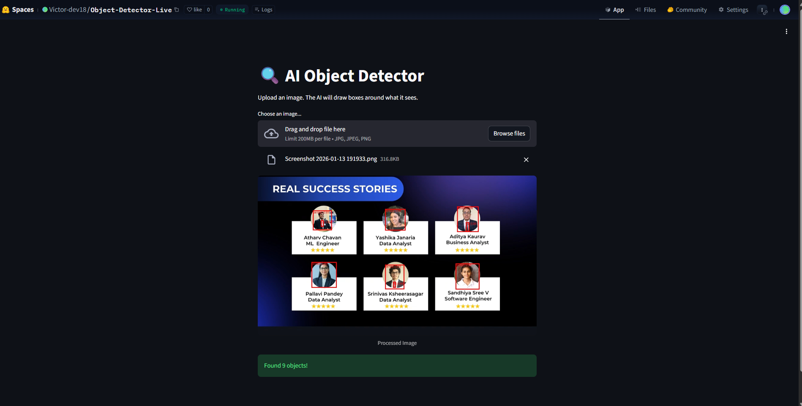

# 🔍 Cloud-Native AI Object Detector

[](https://huggingface.co/spaces/Victor-dev18/Object-Detector-Live)
[](https://www.docker.com/)
[](https://streamlit.io/)

A real-time **Object Detection** application deployed as a **cloud-native microservice**.
It uses Facebook's **DETR (DEtection TRansformer)** model to identify and locate objects within images with high precision.

---

## 🚀 Live Demo

👉 **Try the App here:**
[https://huggingface.co/spaces/Victor-dev18/Object-Detector-Live](https://huggingface.co/spaces/Victor-dev18/Object-Detector-Live)

> ⚠️ *Note:* The app runs on a **free-tier CPU instance**. The first detection may take **10–20 seconds** to warm up the model.

---

## 🧠 How It Works

This project demonstrates a **Serverless / Cloud-Native AI workflow**:

1. **Frontend** – Built with **Streamlit** for a clean, responsive UI
2. **Containerization** – Fully packaged using **Docker (Python 3.9-slim)** for environment consistency
3. **Model** – Uses `facebook/detr-resnet-50` from the Hugging Face Hub

   * End-to-end Transformer model
   * Treats object detection as a direct set prediction problem
4. **Deployment** – Automated build & deploy via **Hugging Face Spaces**

---

## 🛠️ Tech Stack

* **Language:** Python 3.9
* **Framework:** Streamlit
* **ML Libraries:** PyTorch, Hugging Face Transformers
* **Computer Vision:** PIL (Pillow), TIMM
* **DevOps / Cloud:** Docker, CI/CD Pipeline

---

## 📸 Screenshot

### Object Detection in Action




---

## 📦 Run Locally (Docker Required)

### 1️⃣ Clone the Repository

```bash
git clone https://github.com/Victor-dev18/ai-object-detector.git
cd ai-object-detector
```

---

### 2️⃣ Build the Docker Image

```bash
docker build -t object-detector .
```

---

### 3️⃣ Run the Container

```bash
docker run -p 7860:7860 object-detector
```

---

### 4️⃣ Access the App

Open your browser and visit:

```
http://localhost:7860
```

---

## ⭐ Credits

Built with ❤️ by **Victor-dev18**


